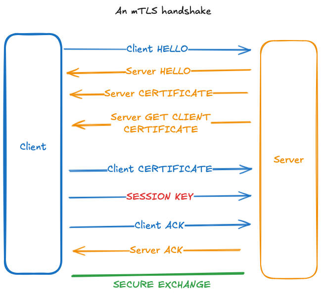

# Internet Security: mTLS

In these notes we provide a short description of the mTLS protocol. This is very similar to the TLS protocol, so we first recap how that works. Afterwards we outline the main differences between mTLS and TLS. Finally, we provide some examples of situations where using mTLS is preferable over TLS.

## What is TLS?

TLS stands for 'Transport Layer Security'. It is a protocol (i.e. a collection of procedures) for transmitting data over a computer network in a secure manner. It can be used in conjunction with other internet protocols such as TCP (in fact, this is what HTTP/1.1 and HTTP/2 does). This added layer of security uses encryption to guarantee that communication between computers cannot be intercepted by malicious actors (think your bank details being compromised when banking online); also, from a client perspective, it makes sure the server is actually who they say they are (think someone impersonating your bank's website).  

### How does it work?

At a high level: 

1. Client requests a secure connection to be established.

2. Server acknowledges the request, and provides identification, usually as a *digital certificate*. This certificate details who the server is and the *Certificate Authority (CA)*—a trusted third party who can vouch for the certificate.

3. Client verifies the certificate.

4. If the client thinks the certificate is valid, it initiates a cryptographic exchange of information using the Diffie-Hellman key exchange algorithm.

Obviously there is more to be said about

- how the client verifies the certificate, and
- how the Diffie-Hellman protocol is implemented.

This requires a separate discussion on basic cryptography, and the details are not actually necessary to understand the difference between mTLS and TLS. Hence we will move on with this description.

## What is mTLS?

mTLS stands for 'mutual Transport Layer Security'. In a nutshell, it is the same protocol as TLS but the client has to authenticate its identity to the server (in TLS only the server has to authenticate its identity to the client). Explicitly, we add some steps to the TLS protocol as follows:

1. Client requests a secure connection to be established.

2. Server acknowledges the request, and provides identification, in form of a digital certificate.

3. Client verifies the certificate.

4. Client provides identification, in form of a digital certificate

5. Server verifies the certificate 

6. If both the client and server can verify the certificate, the initiate a cryptographic exchange of information using the Diffie-Hellman key exchange algorithm.

You can see how this works in the following diagram.

## TLS vs. mTLS

Reasons to prefer TLS:

- The protocol has less steps and is therefore is faster when implemented.

- For most purposes, the one-way authentication used by TLS is sufficient. 

- In large networks, it would be very difficult to provide all clients with a verifiable certificate.

Why use mTLS:

- Communication between businesses. This usually happens in a small network and the users are *homogeneous*, i.e., there is no significant way to divide the users into clients and servers. Furthermore, security is a big concern in this context.

- Protection against credential stuffing in high security environments. Hypothetical: suppose you work at a large company handling sensitive data. Further suppose that your login details to your company's network were compromised, and a malicious actor is trying to use them to impersonate you. If the company uses mTLS then this wouldn't be possible without also having access to your computer. Even if your login details were not compromised, but a cyber attack was taking place using bots to guess your password, the password would not be enough to impersonate you.
